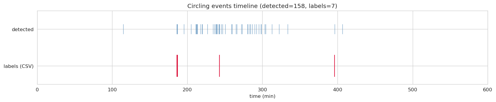
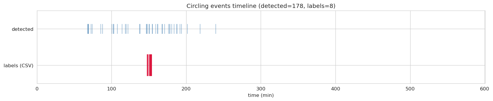
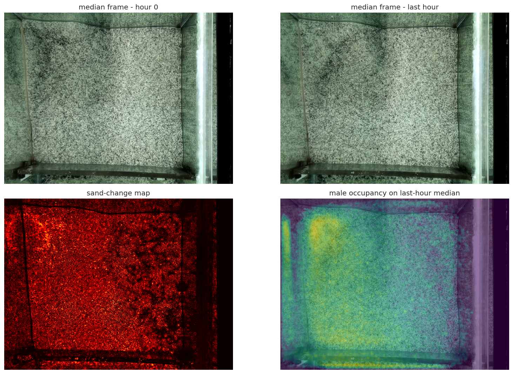

# Ground-Truth Annotations

Main objective is to obtain a human-verified set of labelled circling events for both the seed videos (vid_0028 and vid_0031).
We follow a 2-pass rule : A heuristic based detector auto-annotates the courtship-related circling events and then these spans are manually verified to identify any missed events (false negatives) or false-identified circling spans (false positives).
This is followed by a second human reviewer reviewing the generated labelled set and resolving the comments left from the first review (if any) and building a consensus.

The annotated files for both the videos are kept in `finalized-annotation/` folder

## Results

Detected events against CSV labels. Blue bars are detected events (horizontal length = event duration), crimson ticks mark the midpoint of each CSV-labeled circling span.

### Vid 28 (MC920)



### Vid 31 (F1_613)




## Setup

```
cd ground-truth-annotations
conda env create -f environment.yaml
conda activate cichlid-vision
```

Then open `notebooks/Cichlid-analysis.ipynb` in Jupyter and run the cells top to bottom.

Place the following into `data/` before running the notebook (heavy files are excluded via .gitignore):
- `0028_vid.mp4`, `0028_vid.parquet`, `0028_vid_pairs.parquet`
- `0031_vid.mp4`, `0031_vid.parquet`, `0031_vid_pairs.parquet`

## Auto-annotation rule

Operates on `df_pairs` (one row per FrameNum + ordered pair of TrackUIDs). All six conditions must hold for a row to be flagged as a candidate circling frame:

1. `pair_sex == "FM"` : one male and one female in the pair.
2. `centroid_distance_bl < 1.5` : centroid distance normalized by mean body length of the pair stays within 1.5 body lengths.
3. `cos(rel_heading_rad) < -0.2` : fish headings within roughly 78 degrees of perfect antiparallel.
4. `sign(d_heading_1) == sign(d_heading_2) == sign(d_orbital)` : all three angular velocities co-rotate and are non-zero.
5. `abs(d_orbital_rad_s) >= 0.5` : orbital angular speed of at least 0.5 rad/s, i.e. at least one revolution per ~12.5 seconds.
6. `qc_n_missing_kp_1 <= 2 AND qc_n_missing_kp_2 <= 2` : at most 2 missing keypoints per fish.

Temporal post-processing after per-frame flags:
- Persistence: a run of flagged frames must be at least 2.0 s long.
- Dropout tolerance: up to 1.0 s of False frames allowed inside a run.
- Merge: two adjacent runs separated by at most 2.0 s stitch into one event.

These thresholds live in `src/circling.py` as module-level constants and can be overridden at the call site.

## EDAs and other analyses

### Pose overlay clips

For every CSV-labeled circling event, `batch_render_circling_clips` reads the matching source mp4 over `[StartFrame, StopFrame]`, draws per-keypoint dots + sex-colored skeleton + heading arrow + Sex/TrackID label on each frame, and writes a pose-annotated clip to `data/circling-events/`. Used for visually auditing the CSV ground truth.
This folder is currently empty, since generated .mp4 files are large and excluded via .gitignore.

### Bower detection

Two independent locators combined:
1. **Sand-change map**: pixelwise median of frames sampled across hour 0 vs. the last hour; absolute difference highlights where sand has been moved.
2. **Male-only occupancy heatmap**: 2D histogram of male centroids. Males build and defend bowers, so density concentrates there.

